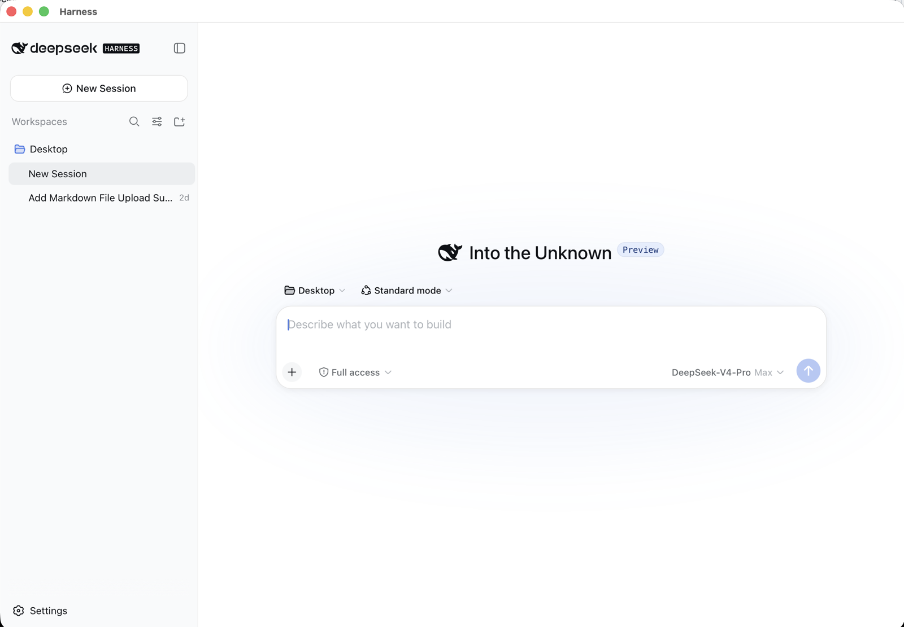

<p align="center"></p>

# Harness.app

**Un lanzador nativo para macOS de [DeepSeek Harness](https://github.com/deepseek-ai/deepseek-harness) (`dsh`). Ejecuta el dsh que *tú* instalaste, en una ventana de Mac de verdad, y lo detiene cuando cierras la ventana. ~1.200 líneas de Objective-C. Sin Electron, sin copia empaquetada de dsh, sin icono residente en la barra de menús.**

Doble clic → arranca *tu* `dsh web` → muestra la interfaz oficial en una ventana nativa → detiene el servidor cuando la cierras.

> Proyecto comunitario no oficial. Sin relación con DeepSeek. `dsh` es suyo; esto es solo una ventana y un gestor de procesos.

> ### 🤖 ¿No quieres leer todo esto? Apunta a tu agente aquí.
> Si usas un agente de programación — **Claude Code, Codex, OpenCode, Hermes, Grok Bot, etc.** — pégale esto y vete a por un café:
>
> ```
> Instala y configura Harness.app en este Mac siguiendo exactamente https://github.com/aconcepcion/harness-app#for-ai-agents. Verifica cada paso, instala dsh con el comando exacto indicado si falta, y avísame cuando esté funcionando.
> ```
> Comprobará los requisitos, instalará `dsh` (con las opciones correctas) si no lo tienes, instalará Harness y confirmará que está funcionando. Las instrucciones que sigue son la sección [Para agentes de IA](#para-agentes-de-ia) de abajo — escrita para ejecutarse al pie de la letra, cada paso verificable.

[English](README.md) · [中文](README.zh.md) · [Para agentes de IA ↓](#para-agentes-de-ia) · [Instalación ↓](#instalación)

## Por qué lo hice

Instalé dsh el día que salió. Es excelente, y es un comando de terminal que abre una pestaña del navegador. Eso está bien durante una hora y resulta molesto al cabo de una semana: la pestaña se pierde entre otras cincuenta, el servidor sigue corriendo en una terminal que olvidaste, y no puedes simplemente hacer clic en un icono del Dock como con cualquier otra aplicación que usas todo el día.

Así que me escribí un pequeño lanzador nativo. Luego miré lo que habían hecho los demás, porque en tres días aparecieron *nueve* repositorios "DeepSeek Harness Desktop". Casi todos toman las mismas decisiones: envolver la interfaz web en Electron o Tauri, **incluir su propia copia de dsh dentro de la aplicación**, esconderse en la barra de menús al cerrar la ventana, y entregarte un binario de 300–500 MB para instalar. El más pulido es un trabajo genuinamente bueno — pero es un *producto*, con su propio calendario de versiones, sus propios servidores de actualización y su propia copia de dsh que va por detrás del original.

Eso es al revés para una herramienta que cambia cada semana. dsh es una versión preliminar para desarrolladores. Aparecen nuevas *release candidates* constantemente, y una de las mejores características de dsh es que **puede modificarse a sí mismo** — pídele que soporte un tipo de archivo que no maneja y él mismo instala el plugin en su propio perfil. Un envoltorio que fija su propia copia de dsh, o que superpone su propio perfil, se interpone exactamente en eso.

Harness.app adopta la postura contraria en cada punto, a propósito:

<p align="center"><br><sub>La interfaz oficial de dsh, intacta, en una ventana nativa de macOS. Lo único que añade Harness es la barra de título y los menús (Server, dsh, Settings).</sub></p>

| | Harness.app | Envoltorio típico |
|---|---|---|
| Qué dsh se ejecuta | **El que instalaste con npm.** Nueva RC del original = un comando; la app nunca necesita actualizarse | Una copia fija dentro del paquete; esperas a su siguiente versión |
| Tamaño / tecnología | Binario universal <400 KB, AppKit + el WebKit del sistema, un solo comando `clang` | 300–500 MB de Electron/Tauri, Chromium empaquetado o cadena de herramientas Rust |
| Confianza | Léelo entero en media hora; `brew` lo compila en *tu* máquina | Un binario (notarizado o no) de un desconocido |
| Cerrar la ventana | **Detiene el servidor** (mantenerlo vivo es opcional; sin barra de menús, sin demonio) | Se esconde en la barra de menús; el servidor sigue corriendo |
| Red | localhost + dos comprobaciones de versión declaradas y desactivables | Servidores de actualización, a veces con contadores de descarga |
| Automodificación de dsh por plugins | Intacta — el mismo `~/.dsh`, los mismos perfiles, tu PATH de shell de inicio | A menudo un perfil personalizado superpuesto |

Si quieres una app de barra de menús con tienda de plugins, usa una de las otras — son buenas en eso. Si quieres tu propio dsh en una ventana nativa que se comporta como un documento, es esta.

## Por qué eso es bueno (si no eres desarrollador de Mac)

- **"Ejecuta tu propio dsh de npm"** — dsh se instala con npm, el gestor de paquetes de Node. Harness no lleva una copia; lanza la que hay en tu máquina. Así que cuando DeepSeek publica una versión nueva, escribes un comando y ya la tienes — Harness nunca tiene que publicar nada. Nunca esperas a un intermediario.
- **"~1.200 líneas de Objective-C, sin Electron"** — las apps Electron empaquetan un navegador Chrome completo para dibujar su ventana (por eso pesan 300–500 MB y consumen mucha memoria). Harness usa el motor de navegador que ya viene en macOS, a través del propio AppKit de Apple. Resultado: una app de menos de 400 KB que abre en un segundo, se siente nativa, y es tan pequeña que cualquier persona curiosa puede leerla *entera* — no hay dónde esconder nada raro. Homebrew incluso la compila desde el código fuente en tu propio Mac.
- **"Sin barra de menús, sin demonio"** — muchos envoltorios de escritorio siguen corriendo en la barra de menús después de cerrar la ventana, con el servidor aún activo. Harness se comporta como un documento: cierras la ventana y desaparece, sin dejar nada corriendo. (Si *quieres* que el servidor siga entre sesiones, hay una casilla para eso — desactivada por defecto.)
- **"Dos comprobaciones de versión declaradas y desactivables"** — el único tráfico de red aparte de hablar con dsh en tu propia máquina es una consulta de versión a npm (para dsh) y a GitHub (para Harness). Ambas son visibles en Ajustes y se pueden desactivar. Sin telemetría, sin llamadas a casa.
- **"Nunca limita a dsh"** — la app no se pone entre tú y el sistema de plugins de dsh. Tu `~/.dsh`, tus perfiles, tu PATH. Todo lo que dsh puede hacer desde la terminal, puede hacerlo dentro de Harness.

## Instalación

**Homebrew (compila localmente, ~2 s, sin aviso de Gatekeeper):**
```sh
brew install aconcepcion/tap/harness-app
cp -R "$(brew --prefix)/opt/harness-app/Harness.app" /Applications/
```
**O desde el código fuente:**
```sh
git clone https://github.com/aconcepcion/harness-app && cd harness-app && make install
```
Requisitos: macOS 13+, Xcode Command Line Tools (`xcode-select --install`), y `dsh` instalado vía npm — **o no**: si no encuentra dsh, Harness te muestra el comando exacto de instalación y te abre la Terminal.

## Primer arranque

1. Abre Harness. Encuentra `dsh` a través de tu shell de inicio (Homebrew, nvm, volta, fnm funcionan todos).
2. Si falta dsh, o Node tiene una versión incorrecta, o las herramientas de shell de dsh están rotas (ver Trampas), te dice exactamente qué ejecutar — de forma visible, en la Terminal. Nada corre a escondidas.
3. Se carga la interfaz web oficial de dsh. Introduce tu clave de API en Settings → Models como siempre.
4. Cierra la ventana: el servidor que arrancó se detiene. (Activa **Server ▸ Keep Server Running After Close** si prefieres que se quede; el siguiente arranque se reconecta al instante.)

## Para agentes de IA

Si eres un agente de IA (Claude Code, Codex, Cursor, Copilot, Hermes, el propio dsh…) al que le piden instalar u operar Harness.app en un Mac, sigue esta sección al pie de la letra. Cada paso tiene un resultado verificable.

**Precondiciones (comprueba, no supongas)**
```sh
sw_vers -productVersion            # necesita 13.0 o superior
xcode-select -p                    # debe imprimir una ruta; si no: xcode-select --install
which brew                         # opcional; habilita la instalación de una línea
which dsh && dsh --version         # opcional; Harness guiará al usuario si falta
node --version                     # dsh necesita ^22.19.0 || >=24.0.0 (23.x NO está soportado)
```

**Instalación (elige una)**
```sh
# A. Tap de Homebrew — compila localmente, sin aviso de Gatekeeper
brew install aconcepcion/tap/harness-app && cp -R "$(brew --prefix)/opt/harness-app/Harness.app" /Applications/
# B. Desde el código fuente
git clone https://github.com/aconcepcion/harness-app ~/harness-app && make -C ~/harness-app install
```

**Verificación**
```sh
/Applications/Harness.app/Contents/MacOS/Harness --version      # imprime 3.0.0
/Applications/Harness.app/Contents/MacOS/Harness --check-env     # salida 0 = dsh encontrado; 1 = falta dsh (el informe explica por qué)
open -a Harness                                                  # arranca; interfaz en http://127.0.0.1:3080 en ~5 s
curl -s -o /dev/null -w '%{http_code}\n' http://127.0.0.1:3080/  # 200 cuando está lista
```

**Si `--check-env` informa `dsh: not found`, instala dsh (este comando exacto; la parte `--allow-scripts` es obligatoria con npm ≥ 11):**
```sh
npm install -g --allow-scripts=@deepseek-ai/dsh-subprocess-local,koffi,node-pty,@google/genai,protobufjs @deepseek-ai/dsh@latest
```
Si informa `node-pty: BROKEN`, ejecuta el mismo comando (repara el binario precompilado de macOS que falta).

**Configuración (todo opcional; surte efecto en Server ▸ Restart Server o en el siguiente arranque)**
```sh
defaults write com.arnoldoconcepcion.harness-app Port -int 3080
defaults write com.arnoldoconcepcion.harness-app Workspace "$HOME/projects"
defaults write com.arnoldoconcepcion.harness-app KeepServerRunning -bool NO
defaults write com.arnoldoconcepcion.harness-app CheckForDshUpdates -bool YES
defaults write com.arnoldoconcepcion.harness-app CheckForAppUpdates -bool YES
open -a Harness "$HOME/projects"        # o: arrancar con una carpeta de trabajo
```

**Operar / diagnosticar**
- Registro: `~/Library/Logs/Harness.app/harness-app.log` (las líneas de Harness llevan el prefijo `[harness-app …]`; después viene la salida propia de dsh).
- Salir = `osascript -e 'quit app "Harness"'` o SIGTERM al proceso `Harness`; el servidor dsh que arrancó se detiene con él salvo que `KeepServerRunning` sea YES.
- Harness nunca modifica `~/.dsh`, nunca instala su propio perfil, y pasa a dsh el entorno de shell de inicio del usuario (`$SHELL -ilc env`). Todo lo que dsh puede hacer desde una terminal, puede hacerlo aquí.
- Desinstalar: `rm -rf /Applications/Harness.app; defaults delete com.arnoldoconcepcion.harness-app` (y `brew uninstall harness-app` si se instaló vía tap). dsh no se toca.

Agentes que contribuyan código: ver [`AGENTS.md`](AGENTS.md) para las convenciones de compilación, pruebas y estilo.

## Qué hace realmente

- **Conectar o arrancar.** Si algo ya responde en el puerto (p. ej. un `dsh web` que arrancaste en una terminal), Harness se conecta y nunca lo mata. Si no, arranca `dsh web --port <Port>` en tu carpeta de trabajo, en su propio grupo de procesos, registrando en `~/Library/Logs/Harness.app/`.
- **Listo = HTTP 200**, no "puerto abierto". Ves una pantalla de espera hasta que la interfaz está realmente ahí.
- **Detener = SIGTERM al grupo de procesos → 5 s → SIGKILL.** Sin shells `node-pty` ni hijos `sandbox-exec` huérfanos.
- **Política ante caídas.** Si dsh muere, Harness lo reinicia una vez; si vuelve a morir en menos de un minuto, aparece un panel de error con el final del registro — nunca una ventana en blanco.
- **Guardia de navegación.** Cualquier cosa que no esté en `127.0.0.1` se abre en tu navegador por defecto.
- **Arrastrar al Dock.** Arrastra una carpeta al icono (o `open -a Harness ~/proyecto`) para usarla como carpeta de trabajo.
- **Perfiles.** Server ▸ Profile lista `~/.dsh/profiles/`; cambiar reinicia el servidor. Harness nunca inyecta un perfil propio.
- **Update dsh… / Repair Shell Tools…** abren la Terminal ejecutando el comando exacto de abajo. Harness no puede saber cuándo termina la Terminal, así que solo te recuerda: Server ▸ Restart Server.

## Actualizar dsh

```sh
npm install -g --allow-scripts=@deepseek-ai/dsh-subprocess-local,koffi,node-pty,@google/genai,protobufjs @deepseek-ai/dsh@latest
```
Esa es toda la historia: dsh es de npm, no nuestro. Harness consulta npm al arrancar y muestra "dsh x.y.z available" en el subtítulo de la ventana cuando hay una versión nueva. Tus perfiles y plugins de `~/.dsh` nunca se tocan (ejecuta `dsh plugin update` si una RC nueva lo necesita).

## Ajustes

Cmd-, o `defaults write com.arnoldoconcepcion.harness-app <Clave> <valor>`:

| Clave | Por defecto | Significado |
|---|---|---|
| `Port` | `3080` | Puerto al que conectarse / en el que arrancar |
| `Workspace` | `$HOME` | Directorio de trabajo del `dsh web` arrancado |
| `Profile` | `web` | `dsh web` para `web`; si no, `dsh --profile <nombre>` |
| `DshPath` | (auto) | Sustituye la búsqueda en el PATH del shell de inicio |
| `KeepServerRunning` | `NO` | Dejar el servidor corriendo tras cerrar |
| `CheckForDshUpdates` | `YES` | `npm view @deepseek-ai/dsh version` al arrancar |
| `CheckForAppUpdates` | `YES` | Consulta de la última release en GitHub al arrancar |

Puerto/carpeta de trabajo/perfil/ruta de dsh se aplican en **Server ▸ Restart Server**.

## Privacidad y red

Harness habla exactamente con tres sitios: `127.0.0.1` (dsh), `registry.npmjs.org` vía `npm view` (comprobación de actualización de dsh) y `api.github.com` (su propia comprobación de actualización). Ambas comprobaciones son visibles en Ajustes y se pueden desactivar. Captura el entorno de tu shell de inicio una vez al arrancar (`$SHELL -ilc env`, con `HA_ENV_CAPTURE=1` definido para que tus archivos rc puedan saltarse trabajo lento) y le pasa ese entorno a dsh — no se envía nada a ninguna parte.

## Trampas que esta app conoce

- **npm ≥ 11 omite los scripts de instalación por defecto**, así que un simple `npm install -g @deepseek-ai/dsh` deja a node-pty sin su binario precompilado para macOS → las herramientas de shell/PTY de dsh quedan muertas en silencio. De ahí `--allow-scripts=…` en cada comando de arriba. Harness detecta el estado roto (falta `node_modules/node-pty/prebuilds/darwin-<arch>/`) y ofrece la reparación.
- **Node 23.x está en el hueco excluido** de los `engines` de dsh (`^22.19.0 || >=24.0.0`). Harness te avisa si tu Node no está soportado.
- **dsh es una versión preliminar para desarrolladores** (rc.x); las RC pueden romper cosas. Precisamente por eso Harness no fija ninguna — tú decides cuándo actualizar.

## Compilar y probar

```sh
make            # Harness.app universal en build/
make test       # pruebas unitarias (descubrimiento del entorno, semver, ciclo de vida del servidor con un dsh falso)
make smoke      # extremo a extremo: arranque en frío, conexión, mantener vivo, escalada a SIGKILL
make install    # copiar a /Applications (firma ad-hoc)
```
Solo hacen falta las Command Line Tools. No hay descarga notarizada a propósito: una app compilada localmente no lleva la marca de cuarentena, y nada en un lanzador de 400 KB justifica pedirte que confíes en un binario.

## Hoja de ruta / fuera de alcance

- Posible v4: un modo genérico para cualquier herramienta web local (Open WebUI, ComfyUI, …) — la configuración ya está orientada a comando/puerto/nombre.
- No previsto: icono en la barra de menús, Node empaquetado, Windows/Linux, actualizaciones con descarga automática.

## Licencia

Harness.app se publica bajo la **Licencia MIT** — una de las licencias de código abierto más permisivas que existen y la que Homebrew, GitHub y la mayoría de las empresas ya saben manejar. En términos sencillos:

- **Puedes** usar, copiar, modificar, fusionar, publicar, distribuir, sublicenciar y vender copias de este software, para cualquier fin, comercial o no, con o sin cambios, sin pedir permiso.
- **Debes** conservar el aviso de copyright y el texto de la licencia en cualquier copia o parte sustancial que distribuyas. Esa es la única condición.
- **Sin garantía.** El software se entrega "tal cual"; el autor no es responsable de nada que ocurra como consecuencia de su uso.

El texto completo está en [`LICENSE`](LICENSE). Las contribuciones se aceptan bajo la misma licencia — al abrir un pull request aceptas que tu contribución queda bajo MIT como el resto.

Harness.app no tiene dependencias de terceros: solo enlaza con los frameworks del sistema de Apple (AppKit, WebKit, Foundation), así que no hay avisos de terceros que reproducir.

**Marcas.** "DeepSeek" y el logotipo de la ballena de DeepSeek son marcas de DeepSeek. Este proyecto no está afiliado ni respaldado, y no usa ninguna de las dos; el nombre "Harness" aquí se refiere a la categoría de software, no a ningún producto de DeepSeek. `dsh` es software de DeepSeek, publicado bajo su propia licencia (MIT en el momento de escribir esto), y no se distribuye con esta app.

© 2026 Arnoldo Concepcion.
