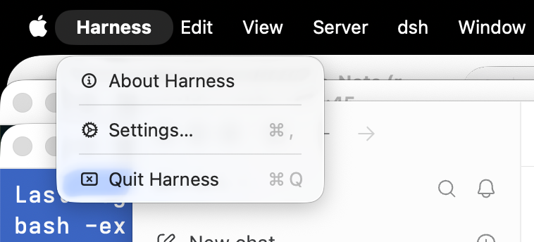
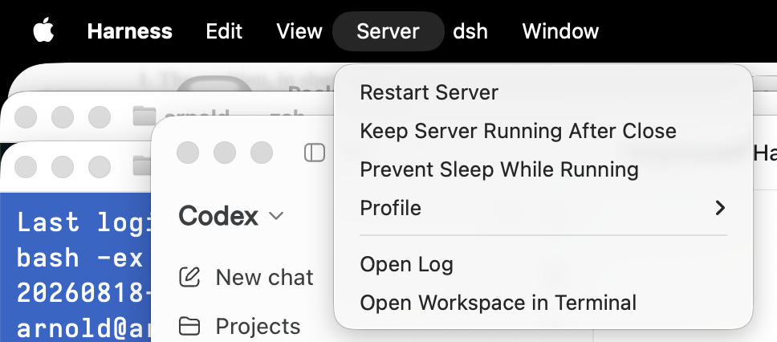
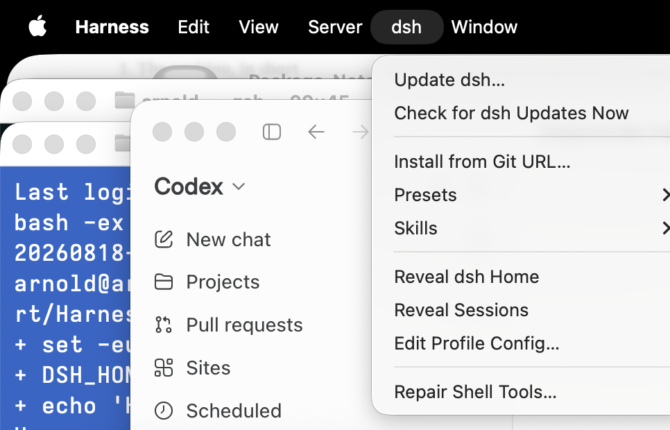

<p align="center"></p>

# Harness.app

**A native macOS launcher for [DeepSeek Harness](https://github.com/deepseek-ai/deepseek-harness) (`dsh`). Runs the dsh *you* installed, in a real Mac window, and stops it when you close the window. ~1,600 lines of Objective-C. No Electron, no bundled copy of dsh, no tray daemon.**

Double-click → it starts *your* `dsh web` → shows the official UI in a native window → stops the server when you close it.

> Unofficial community project. Not affiliated with DeepSeek. `dsh` is theirs; this is just a window and a process manager.

> ### 🤖 Don't want to read all this? Point your agent at it.
> If you use a coding agent — **Claude Code, Codex, OpenCode, Hermes, Grok Bot, etc.** — paste this and go make coffee:
>
> ```
> Install and set up Harness.app on this Mac by following https://github.com/aconcepcion/harness-app#for-ai-agents exactly. Verify every step, install dsh with the exact command given if it is missing, and tell me when it is running.
> ```
> It will check the prerequisites, install `dsh` (with the right flags) if you don't have it, install Harness, and confirm it's running. The instructions it follows are the [For AI agents](#for-ai-agents) section below — written to be executed literally, every step verifiable.

[中文](README.zh.md) · [Español](README.es.md) · [For AI agents ↓](#for-ai-agents) · [Install ↓](#install)

## Why I built this

I installed dsh the day it came out. It's excellent, and it's a terminal command that opens a browser tab. That's fine for an hour and annoying for a week: the tab gets lost among fifty others, the server keeps running in a terminal you forgot about, and you can't just click a Dock icon like every other app you use all day.

So I wrote a small native launcher for myself. Then I looked at what everyone else had done, because within three days there were *nine* "DeepSeek Harness Desktop" repos. Almost all of them make the same choices: wrap the web UI in Electron or Tauri, **ship their own copy of dsh inside the app**, hide to the menu-bar tray when you close the window, and hand you a 300–500 MB binary to install. The most polished one is genuinely good work — but it's a *product*, with its own release schedule, its own update servers, and its own copy of dsh that lags upstream.

That's backwards for a tool that is changing weekly. dsh is a developer preview. New release candidates land constantly, and one of dsh's best features is that **it can modify itself** — ask it to support a file type it doesn't handle and it installs the plugin into its own profile. A wrapper that pins its own dsh, or layers its own profile on top, gets in the way of exactly that.

Harness.app takes the opposite stance on every point, on purpose:

<p align="center"><br><sub>The official dsh UI, untouched, in a native macOS window. The only things Harness adds are the title bar and the menus (Server, dsh, Settings).</sub></p>

| | Harness.app | Typical wrapper |
|---|---|---|
| Which dsh runs | **The one you installed with npm.** New upstream RC = one command; the app never needs updating | A pinned copy inside the bundle; you wait for their release |
| Size / stack | ~400 KB universal binary, AppKit + the system WebKit, one `clang` command | 300–500 MB Electron/Tauri, bundled Chromium or Rust toolchain |
| Trust | Read all of it in half an hour; `brew` compiles it on *your* machine | A notarized (or not) binary from a stranger |
| Close the window | **Stops the server** (opt-in keep-alive; no tray, no daemon) | Hides to a tray; server keeps running |
| Network | localhost + two disclosed, off-able version checks | Update servers, sometimes counted-download endpoints |
| dsh's plugin self-modification | Untouched — same `~/.dsh`, same profiles, your login-shell PATH | Often a custom profile layered on top |

If you want a tray app with a plugin marketplace, use one of the others — they're good at that. If you want your own dsh in a native window that behaves like a document, this is it.

## Why those things are good (if you're not a Mac developer)

- **"Runs your own npm dsh"** — dsh is installed by npm, Node's package manager. Harness doesn't carry a copy; it launches the one on your machine. So when DeepSeek ships a new version, you type one command and you're on it — Harness never has to release anything. You are never waiting on a middleman.
- **"~1,600 lines of Objective-C, no Electron"** — Electron apps bundle an entire Chrome browser to draw their window (that's why they're 300–500 MB and use a lot of memory). Harness uses the browser engine already built into macOS, through Apple's own AppKit. Result: a ~400 KB app that opens in about a second, feels native, and is small enough that a curious person can read *all* of it — there is nowhere for anything sneaky to hide. Homebrew even compiles it from source on your own Mac.
- **"No tray, no daemon"** — many desktop wrappers keep running in the menu bar after you close the window, with the server still going. Harness behaves like a document: close the window, it's gone, nothing left running. (If you *want* the server to stay up between sessions, there's a checkbox for that — off by default.)
- **"Two disclosed, off-able version checks"** — the only network traffic besides talking to dsh on your own machine is a version lookup on npm (for dsh) and on GitHub (for Harness). Both are visible in Settings and can be switched off. No telemetry, no phone-home.
- **"Never constrains dsh"** — the app doesn't put itself between you and dsh's plugin system. Your `~/.dsh`, your profiles, your PATH. Whatever dsh can do from the terminal, it can do inside Harness.

## Install

**Homebrew (compiles locally, ~2 s, no Gatekeeper prompt):**
```sh
brew install aconcepcion/tap/harness-app
cp -R "$(brew --prefix)/opt/harness-app/Harness.app" /Applications/
```
**Or from source:**
```sh
git clone https://github.com/aconcepcion/harness-app && cd harness-app && make install
```
Requirements: macOS 13+, Xcode Command Line Tools (`xcode-select --install`), and `dsh` installed via npm — **or not**: if dsh isn't found, Harness shows you the exact install command and opens Terminal for you.

## First run

1. Open Harness. It finds `dsh` through your login shell (Homebrew, nvm, volta, fnm all work).
2. If dsh is missing, or Node is the wrong version, or dsh's shell tools are broken (see Gotchas), it tells you exactly what to run — visibly, in Terminal. Nothing runs hidden.
3. The official dsh web UI loads. Enter your API key in Settings → Models as usual.
4. Close the window: the server it started stops. (Turn on **Server ▸ Keep Server Running After Close** if you'd rather it stayed; the next launch reattaches instantly.)

## For AI agents

If you are an AI agent (Claude Code, Codex, Cursor, Copilot, Hermes, dsh itself…) asked to install or operate Harness.app on a Mac, follow this section literally. Every step has a verifiable outcome.

**Preconditions (check, don't assume)**
```sh
sw_vers -productVersion            # need 13.0 or newer
xcode-select -p                    # must print a path; else: xcode-select --install
which brew                         # optional; enables the one-line install
which dsh && dsh --version         # optional; Harness will guide the user if missing
node --version                     # dsh needs ^22.19.0 || >=24.0.0 (23.x is NOT supported)
```

**Install (choose one)**
```sh
# A. Homebrew tap — builds locally, no Gatekeeper prompt
brew install aconcepcion/tap/harness-app && cp -R "$(brew --prefix)/opt/harness-app/Harness.app" /Applications/
# B. From source
git clone https://github.com/aconcepcion/harness-app ~/harness-app && make -C ~/harness-app install
```

**Verify**
```sh
/Applications/Harness.app/Contents/MacOS/Harness --version      # prints 3.1.1
/Applications/Harness.app/Contents/MacOS/Harness --check-env     # exit 0 = dsh found; exit 1 = dsh missing (report shows why)
open -a Harness                                                  # launches; UI on http://127.0.0.1:3080 within ~5 s
curl -s -o /dev/null -w '%{http_code}\n' http://127.0.0.1:3080/  # 200 when ready
```

**If `--check-env` reports `dsh: not found`, install dsh (this exact command; the `--allow-scripts` part is mandatory with npm ≥ 11):**
```sh
npm install -g --allow-scripts=@deepseek-ai/dsh-subprocess-local,koffi,node-pty,@google/genai,protobufjs @deepseek-ai/dsh@latest
```
If it reports `node-pty: BROKEN`, run the same command (it repairs the missing macOS prebuild).

**Configure (all optional; take effect on Server ▸ Restart Server or next launch)**
```sh
defaults write com.arnoldoconcepcion.harness-app Port -int 3080
defaults write com.arnoldoconcepcion.harness-app Workspace "$HOME/projects"
defaults write com.arnoldoconcepcion.harness-app KeepServerRunning -bool NO
defaults write com.arnoldoconcepcion.harness-app CheckForDshUpdates -bool YES
defaults write com.arnoldoconcepcion.harness-app CheckForAppUpdates -bool YES
defaults write com.arnoldoconcepcion.harness-app PreventSleepWhileRunning -bool NO
open -a Harness "$HOME/projects"        # or: launch with a workspace folder
```

**Operate / diagnose**
- Log: `~/Library/Logs/Harness.app/harness-app.log` (Harness lines are prefixed `[harness-app …]`; dsh's own output follows).
- Quit = `osascript -e 'quit app "Harness"'` or SIGTERM to the `Harness` process; the dsh server it spawned stops with it unless `KeepServerRunning` is YES.
- Harness never modifies `~/.dsh`, never installs its own profile, and passes the user's login-shell environment (`$SHELL -ilc env`) to dsh. Anything dsh can do from a terminal, it can do here.
- Uninstall: `rm -rf /Applications/Harness.app; defaults delete com.arnoldoconcepcion.harness-app` (and `brew uninstall harness-app` if installed via tap). dsh itself is untouched.

Contributing agents: see [`AGENTS.md`](AGENTS.md) for build, test and code conventions.

## What it actually does

<p align="center">  <br><sub>The parts that are ours: the Harness, Server and dsh menus.</sub></p>

- **Attach or spawn.** If something already answers on the port (e.g. a `dsh web` you started in a terminal), Harness attaches and never kills it. Otherwise it spawns `dsh web --port <Port>` in your workspace, in its own process group, logging to `~/Library/Logs/Harness.app/`.
- **Readiness = HTTP 200**, not "port open". You see a placeholder until the UI is really there.
- **Stop = SIGTERM to the process group → 5 s → SIGKILL.** No orphaned `node-pty` shells or `sandbox-exec` children.
- **Crash policy.** If dsh dies, Harness restarts it once; if it dies again within a minute you get an error sheet with the log tail — never a blank window.
- **Navigation guard.** Anything not on `127.0.0.1` opens in your default browser.
- **Dock drop.** Drag a folder onto the icon (or `open -a Harness ~/project`) to use it as the workspace.
- **Profiles.** Server ▸ Profile lists `~/.dsh/profiles/`; switching restarts the server. Harness never injects a profile of its own.
- **Update dsh… / Repair Shell Tools…** open Terminal running the exact command below, aimed at the npm prefix that owns the dsh Harness found (so a login shell whose first `npm` belongs to another Node install doesn't produce a second, shadowing dsh). Harness can't tell when Terminal is done, so it just reminds you: Server ▸ Restart Server.
- **Presets, skills, plugins.** dsh ▸ Install from Git URL… clones a repository you name and installs what you tick, visibly in Terminal; dsh ▸ Presets / Skills list what is installed. See [below](#presets-skills-and-plugins).
- **Reveal / edit.** dsh ▸ Reveal dsh Home, Reveal Sessions, Edit Profile Config… (`~/.dsh/profiles/<profile>/cordis.patch.yml`, in your plain-text editor) — the files power users end up in anyway, one click away.
- **Prevent Sleep While Running** (Server menu, off by default) holds a power assertion while the server is up, for overnight runs. Idle sleep only — a closed lid still sleeps unless macOS clamshell rules apply. Visible in `pmset -g assertions`.
- **File choosers work.** `<input type=file>` inside the UI opens a native panel (a WKWebView needs a delegate for that; without one the button silently does nothing).

## Presets, skills and plugins

Since dsh launched, the interesting work has been *inside* the harness: two-phase "anchored" agent presets, runtime routers, cognition-suite skills. They all install the same way — copy a directory into `~/.dsh/.agent-presets/` (presets) or `~/.dsh/skills/` (skills), or `dsh plugin --profile web add <path>` (plugins) — then restart dsh and pick the preset in a new session. Harness makes that a menu item without owning any of it:

1. **dsh ▸ Install from Git URL…** — paste a repository URL. Harness runs `git clone --depth 1` into `~/Library/Application Support/Harness.app/sources/<host>/<owner>/<repo>` (the only network call this feature makes; nothing runs at launch).
2. It scans the clone (four levels deep, skipping `.git` and `node_modules`) for directories holding `preset.yml` (an agent preset), `SKILL.md` (a skill), or `package.json` + `cordis.patch.yml` / a `dsh` key / `dsh-plugin` keyword (a plugin), and shows one checkbox per find. Nothing recognised → it says so and offers to reveal the clone and open its README, so you follow the repository's own instructions.
3. **You see the exact script before anything runs** (`bash -ex`, every command echoed). Presets go to `$DSH_HOME/.agent-presets/<id>` (id = directory name, lower-cased; dsh requires `^[a-z0-9][a-z0-9-]*$`), skills to `$DSH_HOME/skills/<name>`, plugins via `dsh plugin --profile <current profile> add <path>`. Anything already there is renamed `<name>.replaced-<timestamp>` — never deleted.
4. Server ▸ Restart Server, then choose the preset in a new session.

**dsh ▸ Presets** and **dsh ▸ Skills** list what is installed (`~/.dsh/.agent-presets`, `~/.dsh/skills`, plus `~/.agents/skills`, which dsh reads too); choosing an entry reveals it in Finder.

Harness does not curate, vet or bundle any of these repositories, and the app process itself never writes into `~/.dsh` — the script does, in a Terminal you are watching. You are trusting the repository you paste, exactly as you would in a terminal.

## Updating dsh

```sh
npm install -g --allow-scripts=@deepseek-ai/dsh-subprocess-local,koffi,node-pty,@google/genai,protobufjs @deepseek-ai/dsh@latest
```
That's the whole story: dsh is npm's, not ours. Harness checks npm at launch and shows "dsh x.y.z available" in the window subtitle when there is one. Your `~/.dsh` profiles and plugins are never touched (run `dsh plugin update` if a new RC needs it).

## Settings

Cmd-, or `defaults write com.arnoldoconcepcion.harness-app <Key> <value>`:

| Key | Default | Meaning |
|---|---|---|
| `Port` | `3080` | Port to attach to / start on |
| `Workspace` | `$HOME` | cwd for the spawned `dsh web` |
| `Profile` | `web` | `dsh web` for `web`, else `dsh --profile <name>` |
| `DshPath` | (auto) | Override the login-shell PATH lookup |
| `KeepServerRunning` | `NO` | Leave the server running after close |
| `PreventSleepWhileRunning` | `NO` | Hold an idle-sleep assertion while the server is up |
| `CheckForDshUpdates` | `YES` | `npm view @deepseek-ai/dsh version` at launch |
| `CheckForAppUpdates` | `YES` | GitHub latest-release check at launch |

Port/workspace/profile/dsh path apply on **Server ▸ Restart Server**.

## Privacy & network

Harness talks to exactly three places on its own: `127.0.0.1` (dsh), `registry.npmjs.org` via `npm view` (dsh update check), and `api.github.com` (its own update check). Both checks are visible in Settings and can be turned off. One more, only when you ask: **dsh ▸ Install from Git URL…** runs `git clone` against the URL you paste — that host, nothing else, and only when you click Fetch. It captures your login-shell environment once at launch (`$SHELL -ilc env`, with `HA_ENV_CAPTURE=1` set so your rc files can skip slow work) and hands that environment to dsh — nothing is sent anywhere.

## Gotchas this app knows about

- **npm ≥ 11 skips install scripts by default**, so a plain `npm install -g @deepseek-ai/dsh` leaves node-pty without its macOS prebuild → dsh's shell/PTY tools are silently dead. Hence `--allow-scripts=…` in every command above. Harness detects the broken state (`node_modules/node-pty/prebuilds/darwin-<arch>/` missing) and offers the repair.
- **Node 23.x is in the excluded gap** of dsh's `engines` (`^22.19.0 || >=24.0.0`). Harness tells you if your Node is unsupported.
- **dsh is a developer preview** (rc.x); RCs can break things. That's precisely why Harness doesn't pin one — you decide when to update.

## Building & testing

```sh
make            # universal Harness.app in build/
make test       # unit tests (env discovery, semver, server lifecycle with a fake dsh, installer scan/script, sleep guard)
make smoke      # end-to-end: cold start, attach, keep-alive, SIGKILL escalation, prevent-sleep assertion
make install    # copy to /Applications (ad-hoc signed)
```
Only Command Line Tools are needed. There is no notarized download on purpose: a locally built app has no quarantine flag, and nothing about a 400 KB launcher justifies asking you to trust a binary.

## Roadmap / non-goals

- Possible v4: a generic mode for any local web tool (Open WebUI, ComfyUI, …) — the config is already command/port/name-driven.
- Not planned: tray icon, bundled Node, Windows/Linux, auto-download updates.

## License

Harness.app is released under the **MIT License** — one of the most permissive open-source licenses in existence and the one Homebrew, GitHub and most companies already know how to handle. In plain terms:

- **You may** use, copy, modify, merge, publish, distribute, sublicense and sell copies of this software, for any purpose, commercial or not, with or without changes, without asking.
- **You must** keep the copyright notice and the license text with any copy or substantial portion you distribute. That is the only condition.
- **No warranty.** The software is provided "as is"; the author is not liable for anything that happens as a result of using it.

The full text is in [`LICENSE`](LICENSE). Contributions are accepted under the same license — by opening a pull request you agree your contribution is MIT-licensed like the rest.

Harness.app has no third-party dependencies: it links only against Apple's system frameworks (AppKit, WebKit, Foundation, IOKit), so there are no bundled third-party notices to reproduce.

**Trademarks.** "DeepSeek" and the DeepSeek whale logo are trademarks of DeepSeek. This project is unaffiliated, unendorsed, and uses neither; the name "Harness" here refers to the software category, not to any DeepSeek product. `dsh` is DeepSeek's software, released under its own license (MIT at the time of writing), and is not distributed with this app.

© 2026 Arnoldo Concepcion.
